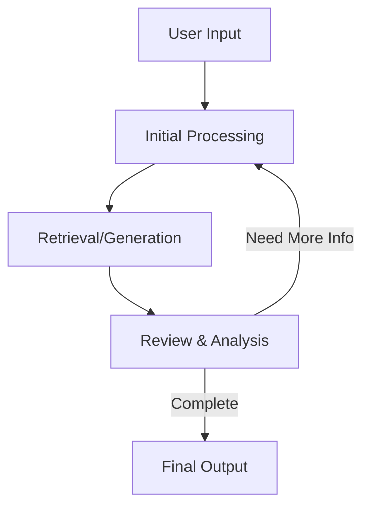

# Agentic RAG Implementations

This repository contains multiple implementations of Agentic RAG (Retrieval-Augmented Generation) systems, each designed for different data sources.

1. **Document Search**: Extends traditional RAG against document chunks with a multi-attempt, iterative refinement process.
2. **Natural Language to SQL (NL2SQL)**: Extends traditional NL2SQL by adding reflection across multiple attempts.

## What is Agentic RAG?

Agentic RAG extends traditional RAG systems by adding multiple attempts with reflection and iteration. Instead of performing a single retrieval-generation cycle, these systems can:

- Maintain state across multiple iterations
- Analyze the completeness and quality of retrieved information
- Make decisions about whether to continue searching
- Refine their retrieval approach based on previous attempts
- Self-correct when errors or gaps are detected

## Why Agentic RAG?

Traditional, single-attempt RAG systems often end up yielding less-than-ideal results. I've written a number of articles on the topic:

https://www.linkedin.com/pulse/my-first-rag-use-case-key-insights-lessons-learned-dan-giannone-sa7ne/?trackingId=6sVQ3wJ%2B6RNZRCNlQa3eBQ%3D%3D
https://www.linkedin.com/pulse/evaluating-rag-applications-deep-dive-dan-giannone-qonce/?trackingId=TLi3D9S4DpMr1o%2BsVTqwpg%3D%3D
https://www.linkedin.com/pulse/non-technical-challenges-rag-dan-giannone-st5ze/?trackingId=QixAT0gS9m5uRFsOr%2BnYIA%3D%3D

Agentic RAG greatly improves the quality of the results by bringing agentic behavior to the retrieval process. We give the system the ability to make multiple attempts, reflect, adjust, and iterate. As with a human, doing these things will yield a much higher quality result. 

## Common Complaints

- "This will impact cost and latency"

In my opinion, accuracy trumps all other considerations when building Gen AI applications. If a user does not feel confident in the results, they will just stop using the application and then your efforts to reduce latency and cost are for naught. We need to establish a high degree of confidence in the results before we try to optimize for other considerations. 

Additionally, we can put different LLMs in different roles to optimize for cost and latency. For example, we can use a smaller LLM for the final synthesis of the results, but use a larger LLM for the review and  reflection.

- "Agentic RAG is a band-aid solution; We should be able to solve this with a single attempt"

Partially true. You should put in the work to optimize your retrieval process so its as accurate as possible on the first attempt. But in reality, data is messy and complex with interconnected relationships. It's unlikely that a single attempt will yield a complete and accurate result at a rate that is acceptable to users.  

- "This will hamper the user experience"

We should be building UIs for the Agent Era. For example, a UI that shows the agent working through the retrieval & iteration process will be much more engaging than a traditional "Loading..." animation. 


## Key Features

Both implementations share core "agentic" characteristics:

- **Stateful Processing**: Maintains context and progress across iterations
- **Iterative Refinement**: Multiple attempts to get complete and accurate results
- **Self-Review**: Analyzes own outputs for completeness and correctness
- **Thought Process Logging**: Maintains clear reasoning chains for transparency
- **Smart Filtering**: Avoids reprocessing previously seen information

## Implementation Summaries

### Document Search System
- Focuses on comprehensive document retrieval
- Maintains lists of vetted and discarded results
- Uses LLM for query generation and result synthesis
- Iterates until all relevant information is found
- [See implementation-specific documentation here](./agentic_doc_chunk_rag/agentic_doc_chunk_rag.md)

### Natural Language to SQL (NL2SQL)
- Converts natural language to SQL queries
- Uses vector search to map user terms to database values
- Supports domain-specific knowledge integration
- Iteratively refines SQL queries until correct
- [See implementation-specific documentation here](./nl2sql/agentic_nl2sql.md)

## Architecture Overview

Both systems follow a similar high-level pattern while specializing for their specific use cases:



## Getting Started

1. Choose the implementation that matches your use case:
   - Use **Document Search** for unstructured document retrieval and synthesis
   - Use **NL2SQL** for structured database querying with natural language

2. Follow the setup instructions in the respective implementation directories:
   - [Document Search Setup](./agentic_doc_chunk_rag/agentic_doc_chunk_rag.md#setup--usage)
   - [NL2SQL Setup](./nl2sql/agentic_nl2sql.md#setup--usage)


## Repository Structure

```
agentic-rag/
├── README.md                         # This file
├── requirements.txt                  # Main requirements file
├── example.env                       # Example environment variables
├── .env                             # Environment variables (not in repo)
├── agentic_doc_chunk_rag/            
│   ├── agentic_doc_chunk_rag.md     # Document search implementation details
│   └── agentic_doc_chunk_rag.py     # Main implementation
└── nl2sql/
    ├── agentic_nl2sql.md           # NL2SQL implementation details
    ├── agentic_nl2sql.py           # Main implementation
    ├── vectorize-sql-data.py       # Data vectorization utility
    └── domain_knowledge.txt        # Domain-specific knowledge
```

## Contributing

Contributions are welcome! Please read our contributing guidelines and submit pull requests for any enhancements, bug fixes, or documentation improvements.

## License

This project is licensed under the MIT License - see the LICENSE file for details.