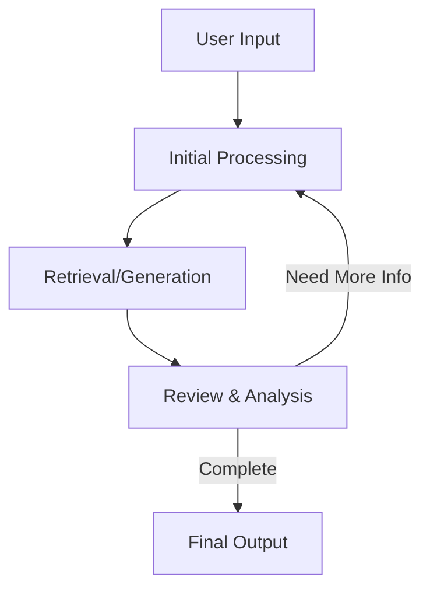

# Agentic RAG Implementations

This repository contains multiple implementations of Agentic RAG (Retrieval-Augmented Generation) systems, each designed for different data sources.

1. **Document Search**: Extends traditional RAG against document chunks with a multi-attempt, iterative refinement process.
2. **Natural Language to SQL (NL2SQL)**: Extends traditional NL2SQL by adding reflection across multiple attempts.

## What is Agentic RAG?

Agentic RAG extends traditional RAG systems by adding multiple attempts with reflection and iteration. Instead of performing a single retrieval-generation cycle, these systems can:

- Maintain state across multiple iterations
- Analyze the completeness and quality of retrieved information
- Make decisions about whether to continue searching
- Refine their retrieval approach based on previous attempts
- Self-correct when errors or gaps are detected

## Key Features

Both implementations share core "agentic" characteristics:

- **Stateful Processing**: Maintains context and progress across iterations
- **Iterative Refinement**: Multiple attempts to get complete and accurate results
- **Self-Review**: Analyzes own outputs for completeness and correctness
- **Thought Process Logging**: Maintains clear reasoning chains for transparency
- **Smart Filtering**: Avoids reprocessing previously seen information

## Implementation Summaries

### Document Search System
- Focuses on comprehensive document retrieval
- Maintains lists of vetted and discarded results
- Uses LLM for query generation and result synthesis
- Iterates until all relevant information is found
- [See implementation-specific documentation here](./agentic_doc_chunk_rag/agentic_doc_chunk_rag.md)

### Natural Language to SQL (NL2SQL)
- Converts natural language to SQL queries
- Uses vector search to map user terms to database values
- Supports domain-specific knowledge integration
- Iteratively refines SQL queries until correct
- [See implementation-specific documentation here](./nl2sql/agentic_nl2sql.md)

## Architecture Overview

Both systems follow a similar high-level pattern while specializing for their specific use cases:



## Getting Started

1. Choose the implementation that matches your use case:
   - Use **Document Search** for unstructured document retrieval and synthesis
   - Use **NL2SQL** for structured database querying with natural language

2. Follow the setup instructions in the respective implementation directories:
   - [Document Search Setup](./agentic_doc_chunk_rag/agentic_doc_chunk_rag.md#setup--usage)
   - [NL2SQL Setup](./nl2sql/agentic_nl2sql.md#setup--usage)


## Repository Structure

```
agentic-rag/
├── README.md                         # This file
├── requirements.txt                  # Main requirements file
├── example.env                       # Example environment variables
├── .env                             # Environment variables (not in repo)
├── agentic_doc_chunk_rag/            
│   ├── agentic_doc_chunk_rag.md     # Document search implementation details
│   └── agentic_doc_chunk_rag.py     # Main implementation
└── nl2sql/
    ├── agentic_nl2sql.md           # NL2SQL implementation details
    ├── agentic_nl2sql.py           # Main implementation
    ├── vectorize-sql-data.py       # Data vectorization utility
    └── domain_knowledge.txt        # Domain-specific knowledge
```

## Contributing

Contributions are welcome! Please read our contributing guidelines and submit pull requests for any enhancements, bug fixes, or documentation improvements.

## License

This project is licensed under the MIT License - see the LICENSE file for details.