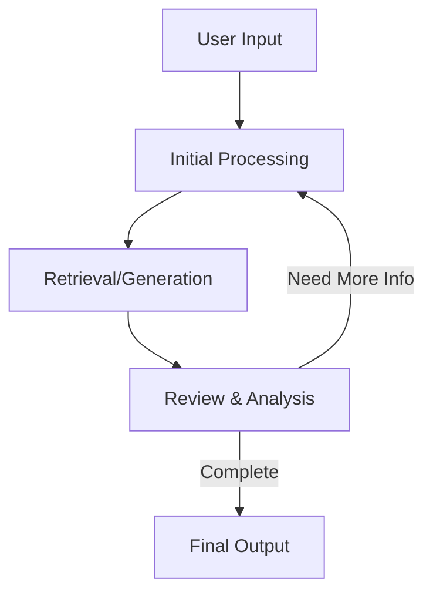

# RAG_Runner

This repository provides multiple implementations of Agentic Retrieval-Augmented Generation (RAG) systems, designed for both unstructured documents and structured databases.

---

## Overview

**Agentic RAG** enhances traditional RAG pipelines by introducing **multi-attempt, reflective reasoning**. Instead of completing the retrieval-generation cycle in a single pass, these systems:

- Reflect on intermediate results
- Maintain state across iterations
- Adjust their retrieval strategies
- Self-correct when outputs are incomplete or inaccurate

---

## Implementations

1. **Document Search**
   Traditional RAG with iterative refinement for document-based knowledge.

2. **Natural Language to SQL (NL2SQL)**
   Agentic reasoning for accurate SQL generation, with multi-step validation and reflection.

---

## Why Agentic RAG?

Conventional RAG pipelines often miss important context due to:

- One-shot retrievals
- Lack of intermediate reasoning
- Limited result validation

## Addressing Common Concerns

### "This will increase cost and latency"

Accuracy is the foundation of trust in GenAI apps. If the user can’t trust the output, low latency and cost savings don’t matter. To optimize:

- Use **smaller models** for initial synthesis
- Use **larger models** only for complex reflection

### "Shouldn’t a well-designed RAG work in one shot?"

In theory, yes. In practice, real-world data is messy, and single-attempt retrieval often fails to produce complete results. Iterative refinement mitigates this.

### "Will this slow down the user experience?"

Agentic systems are best paired with modern UIs that **visualize reasoning steps**. Rather than loading spinners, show progress through thought stages to increase user engagement.

---

## Shared System Features

All implementations in this repo follow a common agentic architecture:

- **Stateful memory** across steps
- **Iterative attempts** with feedback loops
- **Self-assessment** for completeness and accuracy
- **Thought process logging** for transparency
- **Smart filtering** to avoid redundant processing

---

## Architecture Diagram



---

## Implementation Details

### 1. Document Search (Unstructured RAG)

- Retrieves document chunks iteratively
- Maintains "accepted" and "discarded" chunk lists
- Synthesizes results using LLM
- Stops when confidence or coverage is sufficient

### 2. NL2SQL (Structured RAG)

- Converts natural language into executable SQL queries
- Maps ambiguous terms using vector similarity
- Integrates domain knowledge from `.txt` files
- Refines queries across multiple iterations
  → [Documentation](./nl2sql/agentic_nl2sql.md)

---

## Getting Started

### Step 1: Choose Your Use Case

| Use Case               | Implementation           |
| ---------------------- | ------------------------ |
| Unstructured documents | `agentic_doc_chunk_rag/` |
| SQL database querying  | `nl2sql/`                |

### Step 2: Follow Setup Instructions

- [Document RAG Setup](./agentic_doc_chunk_rag/agentic_doc_chunk_rag.md#setup--usage)
- [NL2SQL Setup](./nl2sql/agentic_nl2sql.md#setup--usage)

---

## Repository Structure

```plaintext
agentic-rag/
├── README.md
├── requirements.txt
├── example.env
├── .env                     # Local environment variables (ignored by Git)
├── agentic_doc_chunk_rag/
│   ├── agentic_doc_chunk_rag.md
│   └── agentic_doc_chunk_rag.py
└── nl2sql/
    ├── agentic_nl2sql.md
    ├── agentic_nl2sql.py
    ├── vectorize-sql-data.py
    └── domain_knowledge.txt
```
