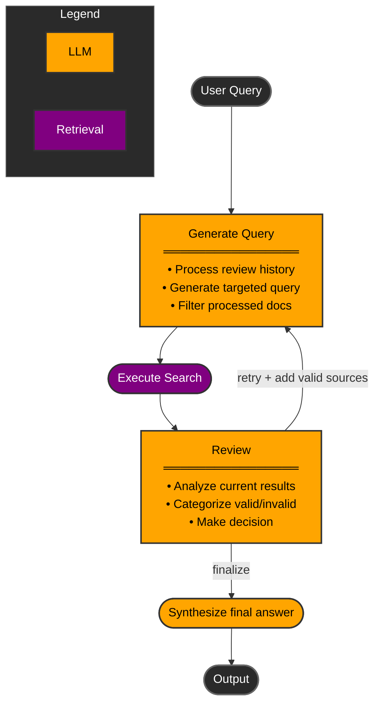

# Agentic Document Search System

This system implements an intelligent document search approach that iteratively refines searches based on content gaps identified in the results. It uses a combination of vector-based search and LLM-powered analysis to ensure comprehensive information retrieval.

## Architecture




The system maintains the following state throughout the search process:

```typescript
ChatState {
    user_input: string           // Original user question
    current_results: Result[]    // Latest batch of search results
    vetted_results: Result[]     // Valid results accumulated across iterations
    discarded_results: Result[]  // Invalid results accumulated across iterations
    processed_ids: Set<string>   // Tracking IDs to avoid reprocessing documents
    reviews: string[]            // Thought processes from review steps
    final_answer: string | null  // Synthesized answer when complete
}
```

### Workflow

The system implements a state machine with the following nodes:

1. **Generate Search Query**
   - Input: User question + previous review thought processes
   - Uses LLM to generate targeted search queries
   - Automatically filters out previously processed documents
   - Returns up to 5 most relevant results

2. **Review Results**
   - Analyzes current search results
   - Outputs:
     - thought_process: Analysis of results
     - valid_results: Indices of useful results
     - invalid_results: Indices of irrelevant results
     - decision: "retry" or "finalize"

3. **Finalize**
   - Synthesizes all vetted results into a final answer
   - Only triggered when review step decides we have complete information

## Example Workflow

Let's walk through an example search for "Show me financials for 2024":

1. **Initial Search**
   ```python
   # Generated search query
   "financials 2024"
   
   # Returns 5 results
   Results[0]: "Q1 2024 Financial Report..."
   Results[1]: "Q2 2024 Revenue Analysis..."
   Results[2]: "Q4 2024 Financial Overview..."
   Results[3]: "2023 Financial Projections..."
   Results[4]: "Company Structure 2024..."
   ```

2. **First Review**
   ```python
   {
       "thought_process": "Found Q1, Q2, and Q4 financials for 2024. Still missing Q3.",
       "valid_results": [0, 1, 2],
       "invalid_results": [3, 4],
       "decision": "retry"
   }
   ```
   - Valid results added to vetted_results
   - Invalid results added to discarded_results
   - Decision "retry" triggers another search iteration

3. **Second Search**
   ```python
   # Generated search query based on review
   "Q3 2024 financials"
   
   # Returns 5 new results (filtered to exclude previously processed docs)
   Results[0]: "Q3 2024 Financial Summary..."
   ...
   ```

4. **Second Review**
   ```python
   {
       "thought_process": "Found Q3 financials. Now have complete quarterly data.",
       "valid_results": [0],
       "invalid_results": [1, 2, 3, 4],
       "decision": "finalize"
   }
   ```
   - Adds Q3 results to vetted_results
   - Decision "finalize" triggers final answer generation

5. **Final Answer**
   - LLM synthesizes information from all vetted results
   - Returns comprehensive answer covering all quarters

## Key Features

- **Stateful Search**: Maintains context across iterations
- **Smart Filtering**: Automatically excludes previously processed documents
- **Iterative Refinement**: Uses review feedback to target missing information
- **Clear Separation**: Keeps track of valid vs invalid results
- **Thought Process Logging**: Maintains reasoning chain for transparency

## Usage

```python
# Initialize the system
graph = build_graph()

# Process a query
final_state = graph.invoke(ChatState(
    user_input="Show me financials for 2024",
    current_results=[],
    vetted_results=[],
    discarded_results=[],
    processed_ids=set(),
    reviews=[],
    final_answer=None
))

print(final_state["final_answer"])
```