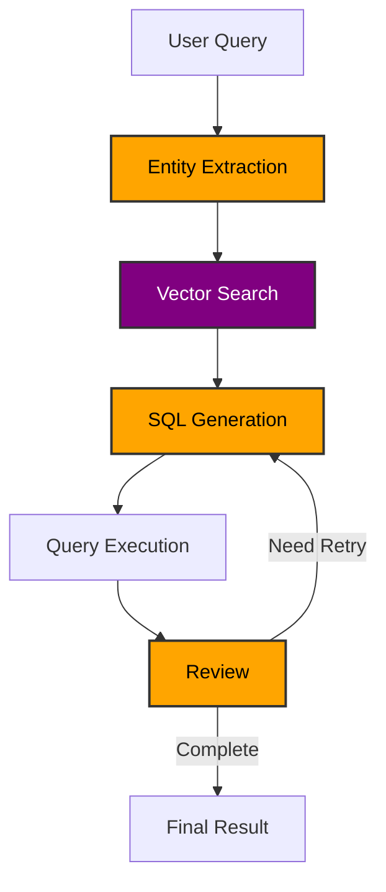

# Agentic Natural Language to SQL (NL2SQL)

This code implements an NL2SQL approach that leverages the vectorized dimensions of the data to generate SQL queries with high accuracy. It also uses an "Agentic RAG" approach to iterate on the SQL query, correcting mistakes and making multiple attempts to get the correct answer. 

## Architecture 

### 1. Data Dimension Vectorization (`vectorize_dimensions.py`)
This script prepares the search index that helps the SQL agent understand the available dimensions and their values:

- Connects to SQL Server database and extracts distinct values from specified columns
- Generates embeddings for these values using Azure OpenAI
- Creates and populates an Azure Cognitive Search vector index

*Note - The better design would be to have the vectors be vector columns in the actual database itself instead of an AI Search Index. This would reduce the number of services that are part of the solution (always a good thing). This is on my TODO list.  

### 2. Agentic NL2SQL System (`agentic_nl2sql.py`)
The main system implements a state machine workflow for processing natural language queries:

1. **Entity Extraction**
   - Extracts relevant entities from the user's natural language query
   - These entities will be used to do a vector search against the vectorized dimensions
   - This is ultimately how we tie the way the user is asking the question to the actual values in the database
   - Example - "How many people watched The Walking Dead in July 2024"? -> "The Walking Dead" 

2. **Vector Search**
   - Performs hybrid search using extracted entities
   - Returns relevant dimension information and metadata
   - Example - "The Walking Dead" -> "Walking Dead, The"  (this is how the AI knows what specifically to query in the DB regardless of the user's phrasing)

3. **SQL Generation**
   - Uses the LLM to generate the SQL query
   - Implements chain-of-thought prompting for better reasoning. LLM outputs its thought process first, then the SQL query (structured outputs)
   - Considers the user query, the database schema/tables/columns, dimension information, and optional domain knowledge

4. **Query Execution & Review**
   - Executes generated SQL queries against the database
   - Reviews results using LLM for completeness and accuracy
   - If the results are not correct, the LLM will provide its thought process and pass that back to the SQL generation step for another attempt
   - Supports up to 3 retry attempts if needed

## Prerequisites

- Python 3.8+
- Azure OpenAI service
- Azure Cognitive Search service
- SQL Server database
- Required Python packages (see requirements.txt)

# steps

1. Run the `vectorize-sql-data.py` script to create the vectorized dimensions in the index
2. (optional) add domain knowledge to the `domain_knowledge.txt` file
3. Run the `agentic_nl2sql.py` script 
4. Ask a question 
5. View run in langsmith
