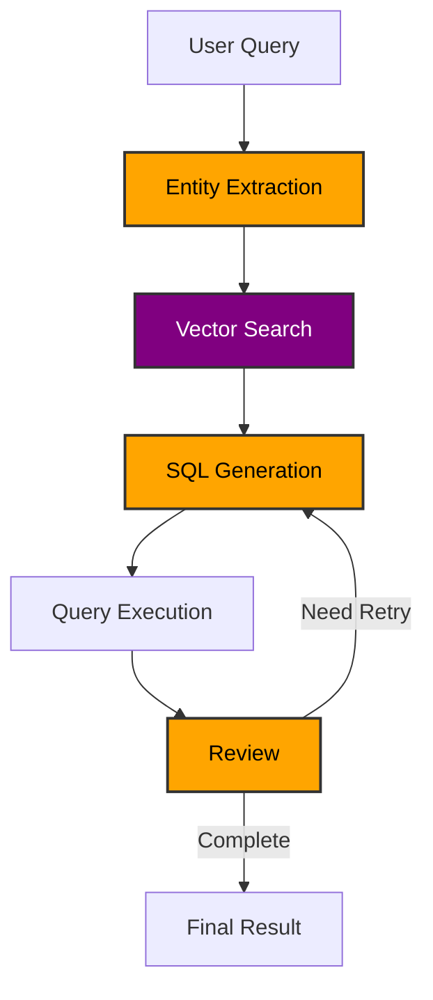
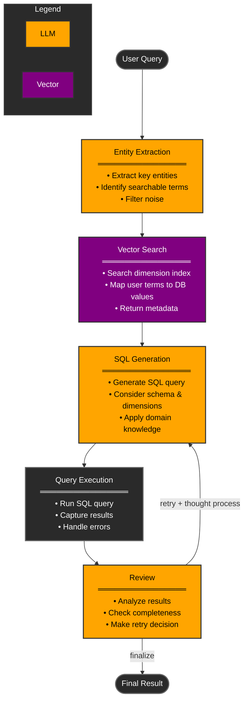

# Agentic Natural Language to SQL (NL2SQL)

This code implements an NL2SQL approach that leverages the vectorized dimensions of the data to generate SQL queries with high accuracy. It also uses an "Agentic RAG" approach to iterate on the SQL query, correcting mistakes and making multiple attempts to get the correct answer. 

## Architecture 




### 1. Data Dimension Vectorization (`vectorize_dimensions.py`)
This script prepares the search index that helps the SQL agent understand the available dimensions and their values:

- Connects to SQL Server database and extracts distinct values from specified columns
- Generates embeddings for these values using Azure OpenAI
- Creates and populates an Azure Cognitive Search vector index


*Note - The better design would be to have the vectors be vector columns in the actual database itself instead of an AI Search Index. This would reduce the number of services that are part of the solution (always a good thing). This is on my TODO list.  

### 2. Agentic NL2SQL System (`agentic_nl2sql.py`)
The main system implements a state machine workflow for processing natural language queries:

1. **Entity Extraction**
   - Extracts relevant entities from the user's natural language query
   - These entities will be used to do a vector search against the vectorized dimensions
   - This is ultimately how we tie the way the user is asking the question to the actual values in the database
   - Example - "How many people watched The Walking Dead in July 2024"? -> "The Walking Dead" 

2. **Vector Search**
   - Performs hybrid search using extracted entities
   - Returns relevant dimension information and metadata
   - Example - "The Walking Dead" -> "Walking Dead, The"  (this is how the AI knows what specifically to query in the DB regardless of the user's phrasing)


3. **SQL Generation**
   - Uses the LLM to generate the SQL query
   - Implements chain-of-thought prompting for better reasoning. LLM outputs its thought process first, then the SQL query (structured outputs)
   - Considers the user query, the database schema/tables/columns, dimension information, and optional domain knowledge

4. **Query Execution & Review**
   - Executes generated SQL queries against the database
   - Reviews results using LLM for completeness and accuracy
   - If the results are not correct, the LLM will provide its thought process and pass that back to the SQL generation step for another attempt
   - Supports up to 3 retry attempts if needed

## Prerequisites

- Python 3.8+
- Azure OpenAI service
- Azure Cognitive Search service
- SQL Server database
- Required Python packages (see requirements.txt)


# steps

1. Run the `vectorize-sql-data.py` script to create the vectorized dimensions in the index
2. (optional) add domain knowledge to the `domain_knowledge.txt` file
3. Run the `agentic_nl2sql.py` script 
4. Ask a question 
5. View run in langsmith


# Agentic Natural Language to SQL (NL2SQL)

This system implements an intelligent approach to converting natural language queries into SQL by using vector-based dimension search and iterative refinement. It leverages LLMs for entity extraction and SQL generation while using vector search to accurately map user terms to database values.

## Architecture



## Key Features

- **Vector-Based Dimension Mapping**: Accurately maps user terms to database values
- **Iterative Refinement**: Multiple attempts to get correct answer
- **Chain of Thought**: Clear reasoning chain for transparency
- **Error Handling**: Graceful handling of SQL errors and empty results
- **Domain Knowledge Integration**: Supports custom business logic and rules


## State Management

The system maintains the following state throughout query processing:

```typescript
ChatInteractionState {
    user_input: string           // Original user question
    database: string            // Target database name
    schema: string             // Database schema
    entity_list: string[]      // Extracted entities
    dimension_info: string     // Vector search results
    current_attempt: AttemptState | null  // Current processing state
    attempt_history: AttemptState[]      // Previous attempts
}

AttemptState {
    attempt_number: int
    sql_agent_thought_process: string
    generated_sql: string
    query_results: string
    review_agent_thought_process: string
}
```

## Workflow

The system implements a state machine with the following nodes:

1. **Entity Extraction**
   - Input: User natural language question
   - Uses LLM to extract key entities and terms
   - Filters out temporal data and noise
   - Returns list of searchable entities

2. **Vector Search**
   - Searches vector index for each entity
   - Maps user terms to actual database values
   - Returns relevant dimension information and metadata

3. **SQL Generation**
   - Generates SQL using:
     - User question
     - Database schema
     - Dimension information
     - Domain knowledge
     - Previous attempt analysis (if any)
   - Returns thought process and SQL query

4. **Query Execution**
   - Executes SQL against database
   - Captures results or errors
   - Returns execution output

5. **Review**
   - Analyzes query results
   - Checks for completeness
   - Decides to retry or finalize
   - Limited to 3 total attempts

## Example Workflow

Let's walk through a sample query: "How many people watched The Walking Dead in July 2024?" This example demonstrates how each step adds value to the process:

1. **Entity Extraction**
   ```python
   # LLM identifies key entity
   entities = ["The Walking Dead"]
   ```
   **Explanation**: Entity extraction is crucial because it identifies the key terms we need to search for in our database. Users might reference content in various ways (e.g., "Walking Dead", "TWD", "The Walking Dead"), but we need to know exactly what to search for. By extracting entities first, we separate the important search terms from temporal data (July 2024) and noise words.

2. **Vector Search**
   ```python
   # Search results for "The Walking Dead"
   Results[0]: {
     "content": "Walking Dead, The",
     "tableName": "V_FCT_RAG_MODEL_CONTENT_VIEWS_MOCK",
     "@search.score": 0.92
   }
   ```
   **Explanation**: This step is essential for accuracy - it maps how users naturally refer to content to how it's actually stored in the database. Without this step, the SQL query might fail because it's looking for "The Walking Dead" when the database stores it as "Walking Dead, The". Vector search helps bridge this gap by finding the closest matching dimension values regardless of exact phrasing.

3. **SQL Generation**
   ```sql
   -- Generated SQL using mapped show name
   SELECT COUNT(DISTINCT viewer_id) as viewer_count
   FROM V_FCT_RAG_MODEL_CONTENT_VIEWS_MOCK
   WHERE show_name = 'Walking Dead, The'
   AND MONTH(view_date) = 7
   AND YEAR(view_date) = 2024;
   ```
   **Explanation**: The SQL generation step uses all the context we've built up - the mapped show name from vector search, the database schema knowledge, and any domain-specific rules. It can generate accurate SQL because it knows both what the user wants (from entity extraction) and how to find it (from vector search). The LLM also provides its thought process, taking advantage of the power of chain of thought prompting.

4. **Review & Iteration**
   ```python
   # Review analysis
   {
     "thought_process": "Query returned 0 results. Show name is correct, 
      but data might not be available for July 2024 yet. Should try 
      with most recent available month.",
     "decision": "retry"
   }
   ```
   **Explanation**: The review step is what makes this process "agentic". The LLM reviews the output and determines if it needs to retry the query or if it has the correct answer. If our SQL generates a syntax error or returned no results, the LLM will provide its thought process and pass that back to the SQL generation step for another attempt. If it only partially answers the user question, the LLM will note that and retry. This allows the system to iteratively refine the query until it gets a correct answer. 

What makes this workflow powerful is how each step builds on the previous ones:
- Entity extraction identifies what to search for
- Vector search maps user terms to database values
- SQL generation uses this mapped data for accurate queries
- Review ensures we got meaningful results and can retry if needed

This creates a much more reliable system than trying to go directly from natural language to SQL, as each step helps bridge the gap between how users ask questions and how data is actually stored.

## Setup & Usage

1. **Environment Setup**
   - Create virtual environment and activate it
   - Copy `example.env` to `.env` and update variables:
     - Azure OpenAI settings
     - Azure Cognitive Search settings
     - SQL Server connection details
   - Optional: Configure Langsmith for tracing

2. **Data Preparation**
   - Run `vectorize-sql-data.py` to:
     - Extract dimension values from database
     - Generate embeddings
     - Create and populate vector index

3. **Optional Configuration**
   - Add domain-specific knowledge to `domain_knowledge.txt`
   - Configure maximum retry attempts

4. **Running the System**
   ```bash
   python agentic_nl2sql.py
   ```
